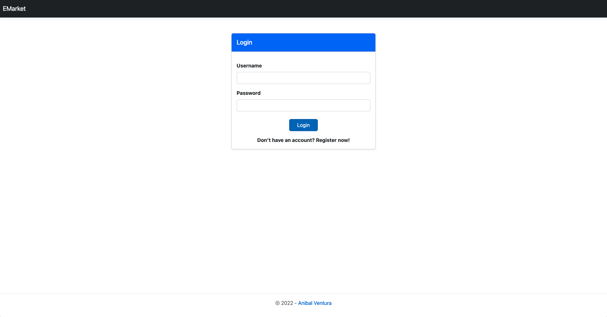
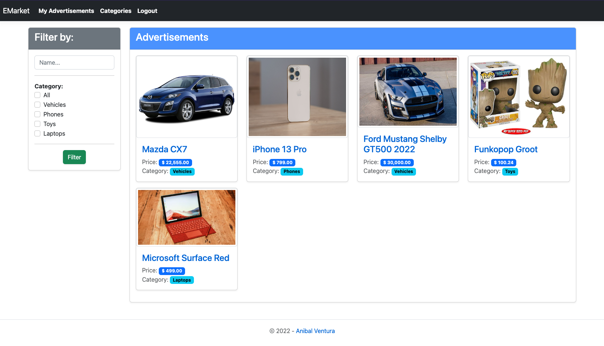
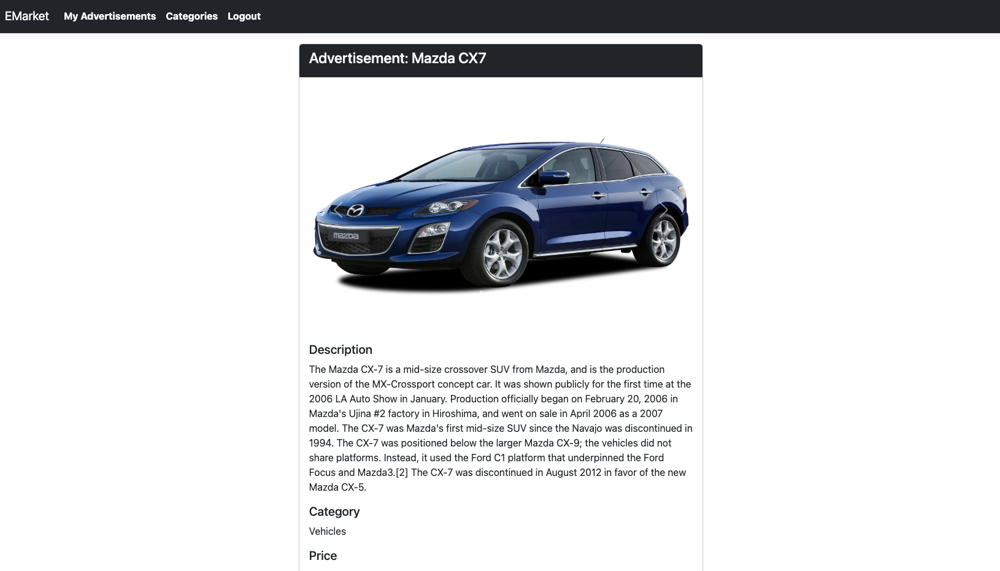
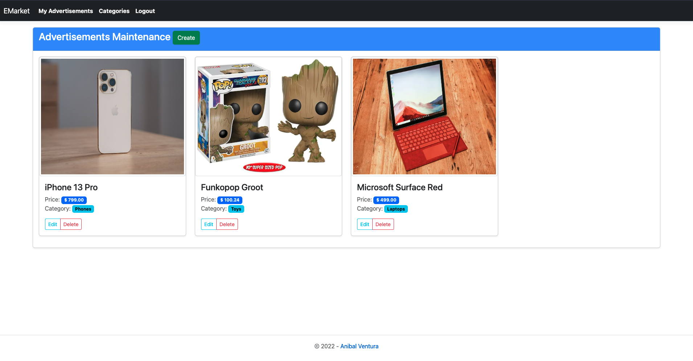
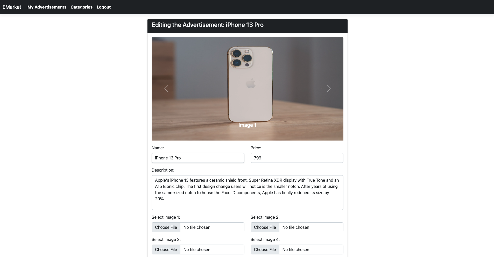
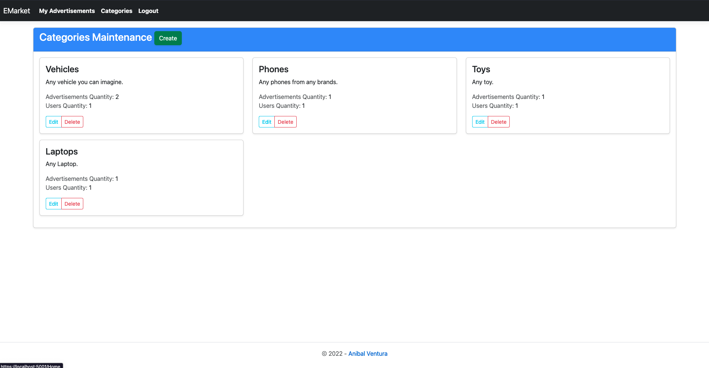
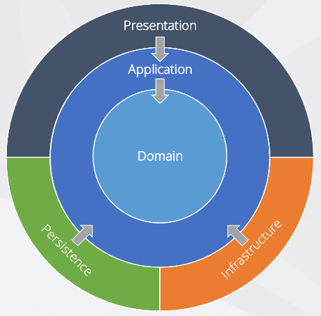

# E-Market

[](https://dotnet.microsoft.com)
[](LICENCE.md)

<p align="center">
  
  
  
  
  
  
</p>

Web app made with ASP.NET, FluentAPI, ONION Architecture and SQL Server.

## Features

- Data persistence with SQL Server.
- Login, register and logout a user.
- Home page to see all users advertisements, except of logged user.
- Click to see all info of a publication and images (up to 4) in carousel style.
- Filter advertisements in home page by name and category.
- Advertisements and Category maintenance pages to perform CRUD operations.
- Logged user can only edit his advertisements.
- See how many active advertisements have a category with how many users.
- Form validations.
- Delete confirmations.

## Technologies

- [ASP.NET](https://dotnet.microsoft.com/en-us/apps/aspnet)
- [Fluent API](https://docs.microsoft.com/en-us/ef/ef6/modeling/code-first/fluent/relationships)
- [SQL Server](https://www.microsoft.com/en-us/sql-server/sql-server-downloads)
- [Bootstrap](https://getbootstrap.com)

## Architecture

Onion Architecture provide a better way to build applications in perspective of better testability, maintainability, and dependability. Onion Architecture addresses the challenges faced with 3-tier and n-tier architectures, and to provide a solution for common problems.



## Dependencies

- [Microsoft.AspNetCore.Http - v2.2.2](https://www.nuget.org/packages/Microsoft.AspNetCore.Http)
- [Microsoft.AspNetCore.Http.Abstractions - v2.2.0](https://www.nuget.org/packages/Microsoft.AspNetCore.Http.Abstractions)
- [Microsoft.AspNetCore.Http.Extensions - v2.2.0](https://www.nuget.org/packages/Microsoft.AspNetCore.Http.Extensions)
- [Microsoft.EntityFrameworkCore - v5.0.17](https://www.nuget.org/packages/Microsoft.EntityFrameworkCore)
- [Microsoft.EntityFrameworkCore.InMemory - v5.0.17](https://www.nuget.org/packages/Microsoft.EntityFrameworkCore.InMemory)
- [Microsoft.Extensions.Options.ConfigurationExtensions - v5.0.0](https://www.nuget.org/packages/Microsoft.Extensions.Options.ConfigurationExtensions)
- [Newtonsoft.Json - v13.0.1](https://www.nuget.org/packages/Newtonsoft.Json)
- [Microsoft.EntityFrameworkCore.SqlServer - v5.0.17](https://www.nuget.org/packages/Microsoft.EntityFrameworkCore.SqlServer)
- [Microsoft.AspNetCore.Mvc.Razor.RuntimeCompilation - v5.0.17](https://www.nuget.org/packages/Microsoft.AspNetCore.Mvc.Razor.RuntimeCompilation)
- [Microsoft.EntityFrameworkCore.Tools - v5.0.17](https://www.nuget.org/packages/Microsoft.EntityFrameworkCore.Tools)
- [Microsoft.VisualStudio.Web.CodeGeneration.Design - v5.0.2](https://www.nuget.org/packages/Microsoft.VisualStudio.Web.CodeGeneration.Design)

## Build

1. Create a SQL Server database.

2. Open solution in [Visual Studio](https://visualstudio.microsoft.com) and edit the `ConnectionStrings` section on `appsettings.json` in `WebApp` layer.

```json
"ConnectionStrings": {
    "DefaultConnection": "Server=localhost,PortNumber;Database=DatabaseName;User=DatabaseUser;Password=DatabasePassword;Trusted_Connection=false;MultipleActiveResultSets=true"
  }
```

3. Run migrations.

- On Windows: Open `Package Console` and run:

```
Add-Migration Initial
Update-Database
```

- On Linux/MacOS: Install [.NET Core CLI tools](https://docs.microsoft.com/en-us/ef/core/get-started/overview/install#get-the-net-core-cli-tools) and run in terminal:

```
dotnet ef --startup-project ./WebApp/EMarket/ migrations add Initial
dotnet ef --startup-project ./WebApp/EMarket/ database update
```

4. Run the project.

## License

```xml
MIT License

Copyright (c) 2022 Anibal Ventura
```
